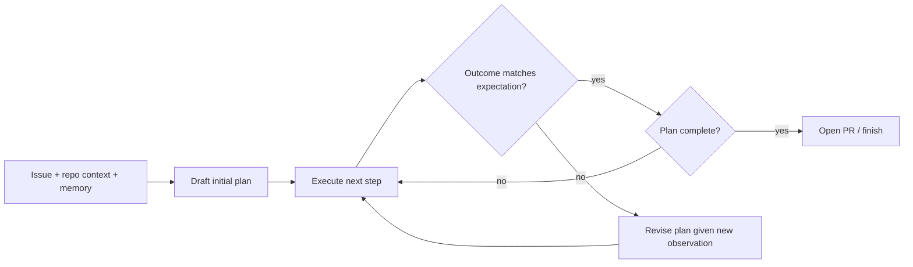

# Agent Reasoning Frameworks

Kestrel supports multiple reasoning strategies, selected per-run based on task complexity (a one-line typo fix doesn't need Tree-of-Thoughts; a cross-cutting refactor might).

## Planning framework

Every run starts with a **plan**: an ordered list of steps (read files, propose diff, run tests, etc.) produced by the Planner component. The plan is not fixed upfront — it's revised after each step based on new observations (a failing test can add a "investigate failure" step mid-run). This is a re-planning loop, not a one-shot plan.

## Tree of Thoughts (ToT)

For ambiguous or high-stakes steps (e.g., choosing an approach to a non-trivial bug), the Planner can branch: generate 2-4 candidate next steps, cheaply evaluate each (e.g., "does this approach touch fewer files / align better with existing patterns per semantic memory"), and either commit to the best branch or — for the highest-stakes decisions — actually execute a cheap probe (like a targeted grep or a dry-run) for more than one branch before committing. ToT is used selectively, not on every step, because it multiplies LLM calls.

## Debate framework

For decisions where reasonable engineers would disagree (e.g., "fix the symptom vs. fix the root cause, which touches more files"), Kestrel can run two agent personas — an "Implementer" arguing for the fast fix and a "Maintainer" arguing for the more thorough one — for a fixed number of rounds, then a third "Arbiter" role picks a direction with reasoning attached to the run's plan summary (visible to the human reviewer). This surfaces trade-offs to the human rather than silently picking one.

## Reflection loop

After every run (success or failure), the Reflector component asks a structured set of questions against the episodic record:
- What was the initial plan vs. what actually happened, and why did they diverge?
- Which step, if any, took disproportionately long or needed the most retries?
- Is there a fact worth writing to semantic memory (see `memory-architecture.md`)?
- If the run failed: is this a one-off (bad luck, flaky test) or a pattern worth flagging (e.g., "this repo's CI is flaky on step X")?

Reflection output is itself structured (not free text) so it can be aggregated for agent benchmarking (below) without re-reading every transcript.

## Failure analysis

Failed runs are categorized (not just logged) into a fixed taxonomy: `environment_error` (e.g., missing dependency), `planning_error` (agent chose a wrong approach), `tool_error` (a tool call itself failed, e.g., git push rejected), `ambiguous_requirements` (issue was underspecified), `timeout`. This taxonomy feeds both the DLQ review process (see `../architecture/05-queue-architecture.md`) and product decisions about which failure class to invest in reducing next.

## Agent benchmarking

A held-out suite of representative issues (varying language, repo size, task type) is run against each new agent/prompt version before rollout, scored on: fix correctness (tests pass), plan efficiency (steps/tokens used), and human-approval rate (did the reviewer accept without changes). This is Kestrel's regression test suite *for the agent itself*, run in CI-like fashion on every meaningful prompt or planning-logic change — not a one-time eval.

## Autonomous tool creation (design note)

Longer-term, an agent that repeatedly performs the same multi-step tool sequence (e.g., "check migration compatibility") can propose codifying it as a new named tool, which a human approves and adds to the tool registry. This keeps tool creation **human-gated** rather than fully autonomous, deliberately — an agent silently expanding its own capability set is a control risk, not just a feature.
