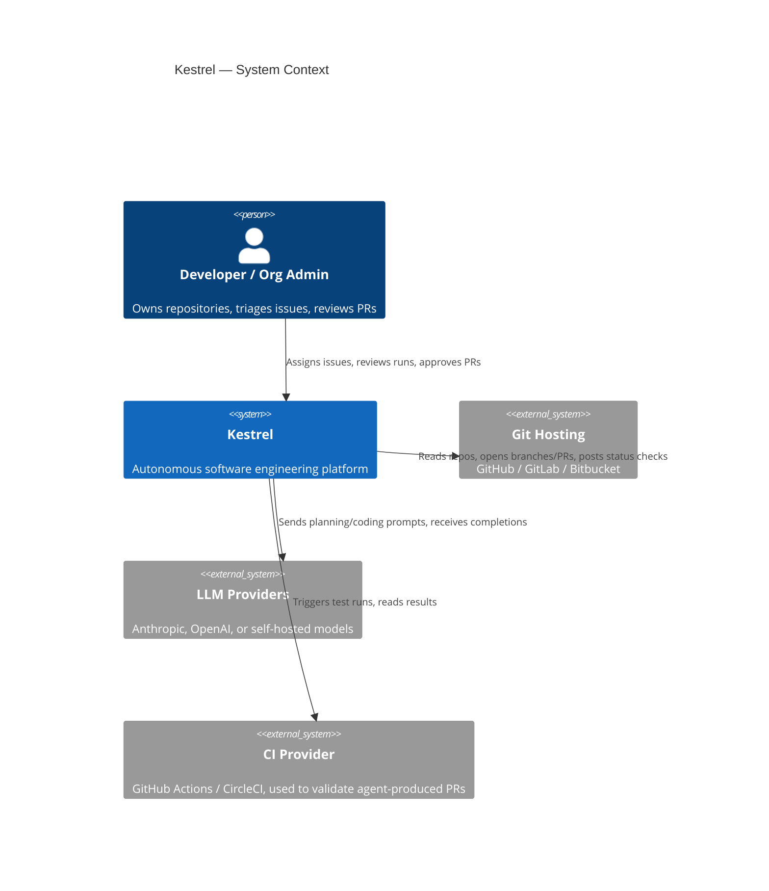
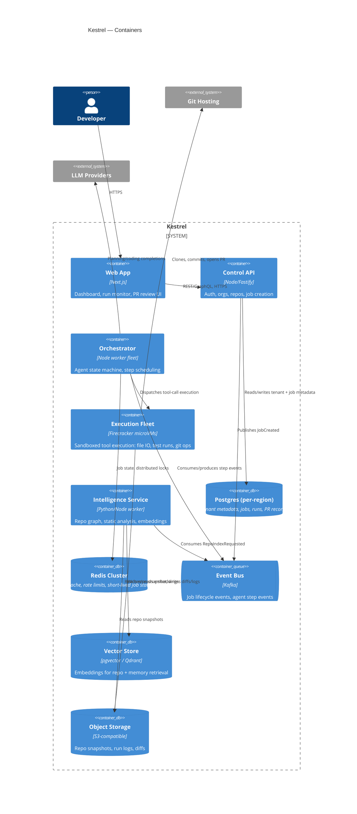
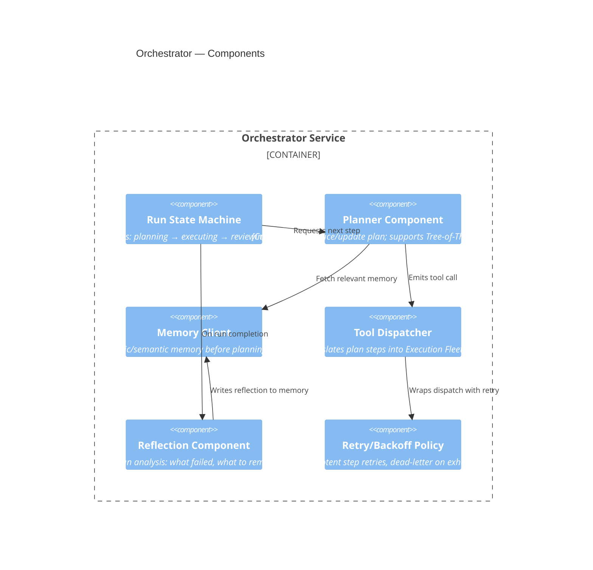
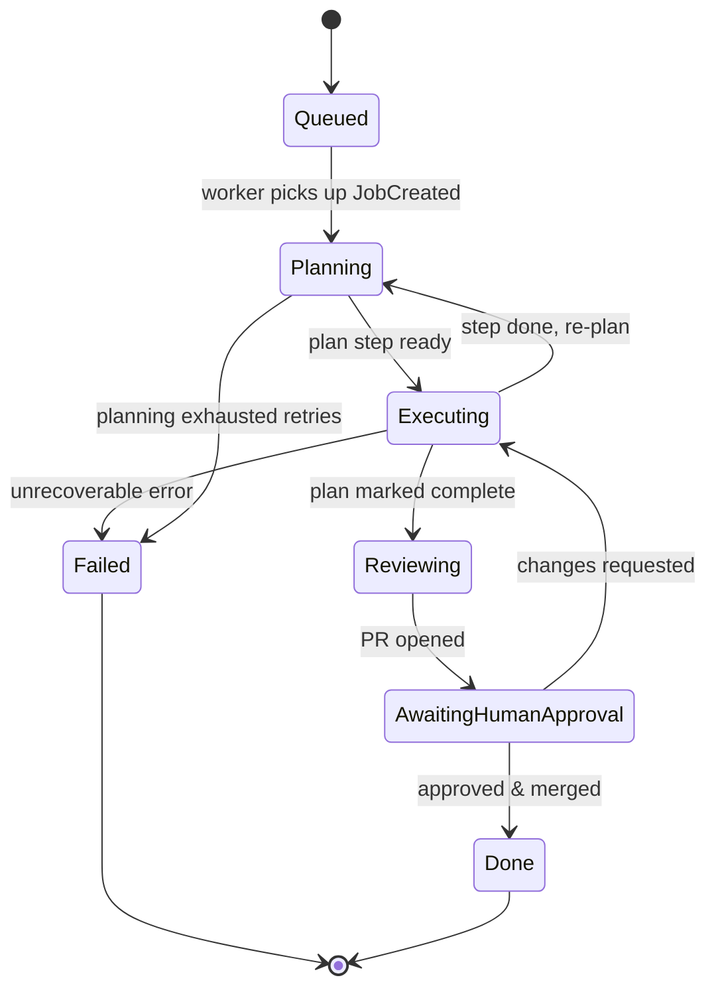

# C4 Diagrams

Rendered in Mermaid. Paste into any Mermaid-compatible viewer (GitHub renders these natively).

## Level 1 — System Context

## Level 2 — Containers

## Level 3 — Components (Orchestrator)

## Level 4 — Code (illustrative, Run State Machine)

